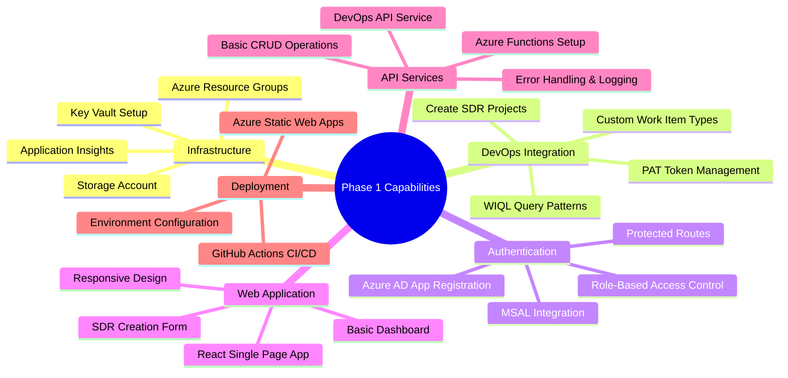
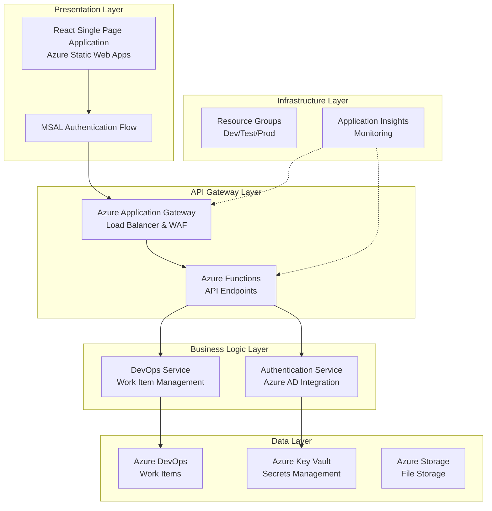
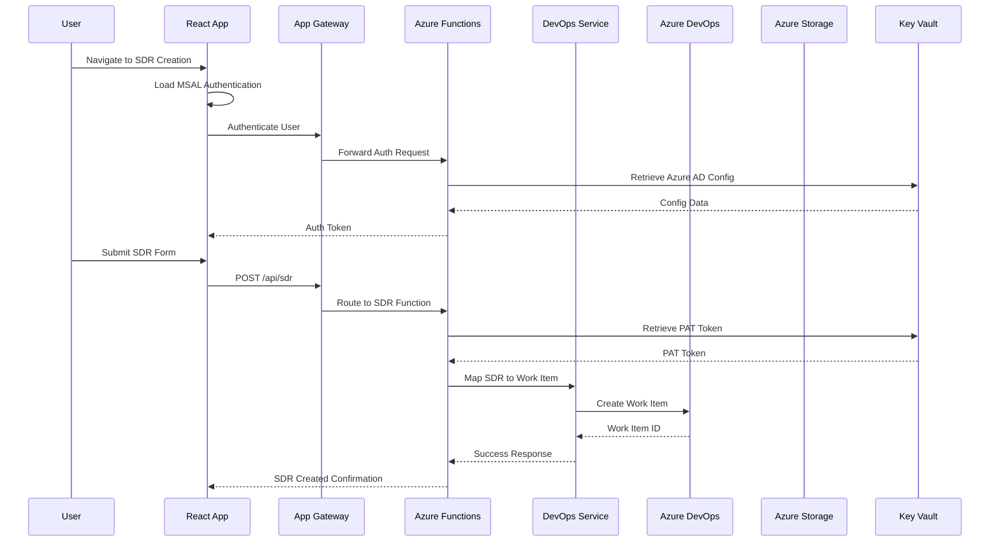
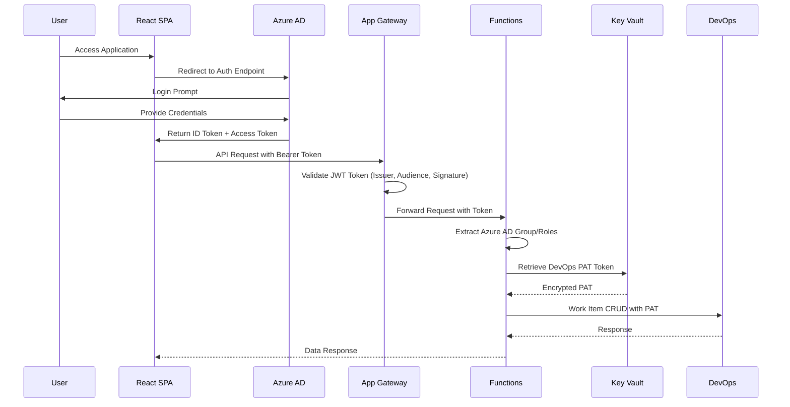

# Phase 1 Architecture Document: SDR Management System Foundation
## Detailed Technical Design for Foundation Phase (Weeks 1-4)

**Document Version:** 1.0
**Date:** August 30, 2025
**Author:** System Architect
**Phase:** Phase 1 - Foundation
**Scope:** Basic SDR creation and management with DevOps integration

---

## Table of Contents

1. [Phase 1 Overview](#1-phase-1-overview)
2. [Phase 1 Architecture Diagrams](#2-phase-1-architecture-diagrams)
3. [Phase 1 Component Architecture](#3-phase-1-component-architecture)
4. [Phase 1 Data Models](#4-phase-1-data-models)
5. [Phase 1 API Specifications](#5-phase-1-api-specifications)
6. [Phase 1 Security Architecture](#6-phase-1-security-architecture)
7. [Phase 1 Infrastructure Requirements](#7-phase-1-infrastructure-requirements)
8. [Phase 1 Deployment Architecture](#8-phase-1-deployment-architecture)

---

## 1. Phase 1 Overview

### 1.1 Phase Objectives
Phase 1 establishes the core foundation for the SDR Management System with the following key deliverables:

- **Infrastructure Foundation:** Azure resource groups, Key Vault, Storage Account, and Application Insights
- **DevOps Integration:** Create and configure DedicatedDevOps projects with custom SDR work item types
- **Authentication Framework:** Azure AD integration using MSAL for web applications
- **Basic Web Application:** React-based SDR creation form with Azure Static Web Apps hosting
- **API Services Layer:** Azure Functions for DevOps Work Item CRUD operations

### 1.2 Phase 1 Capabilities


---

## 2. Phase 1 Architecture Diagrams

### 2.1 Phase 1 High-Level Architecture



### 2.2 Phase 1 Data Flow Architecture



### 2.3 Phase 1 Security Flow



---

## 3. Phase 1 Component Architecture

### 3.1 Frontend Architecture (Phase 1 Scope)

#### 3.1.1 React Application Structure
```typescript
// Phase 1 Frontend Architecture
src/
├── app/                      // Application shell
│   ├── App.tsx              // Main application component
│   ├── store/               // Redux store configuration
│   │   ├── store.ts
│   │   └── authSlice.ts      // Authentication state
│   ├── router/              // React Router setup
│   │   └── AppRouter.tsx
│   ├── config/              // Configuration module
│   │   └── msalConfig.ts     // MSAL configuration
│   └── layout/              // Layout components
│       └── Layout.tsx       // Main layout wrapper
├── features/
│   ├── auth/                // Authentication feature
│   │   ├── components/
│   │   │   ├── LoginButton.tsx
│   │   │   ├── LogoutButton.tsx
│   │   │   └── ProtectedRoute.tsx
│   │   ├── hooks/
│   │   │   └── useAuthentication.ts
│   │   ├── services/
│   │   │   └── authService.ts
│   │   └── types/
│   │       └── auth.types.ts
│   └── sdr/                 // SDR management feature
│       ├── components/
│       │   ├── SDRForm.tsx             // Main SDR creation form
│       │   ├── SDROverview.tsx         // Basic SDR list view
│       │   └── SDRCard.tsx             // Individual SDR display
│       ├── hooks/
│       │   ├── useSDRs.ts
│       │   └── useCreateSDR.ts         // SDR creation hook
│       ├── services/
│       │   └── sdrApi.ts               // API service layer
│       └── types/
│           └── sdr.types.ts            // SDR data types
├── shared/
│   ├── components/
│   │   ├── Button.tsx
│   │   ├── Input.tsx
│   │   ├── LoadingSpinner.tsx
│   │   └── ErrorBoundary.tsx
│   ├── hooks/
│   │   ├── useApi.ts                   // Generic API hook
│   │   └── useLocalStorage.ts          // Local storage utility
│   ├── utilities/
│   │   ├── dateUtils.ts
│   │   ├── validation.ts
│   │   └── formatters.ts
│   └── types/
│       └── common.types.ts
├── environments/
│   ├── environment.ts         // Environment interfaces
│   └── azureConfig.ts         // Azure-specific configurations
└── index.tsx                  // Application entry point
```

#### 3.1.2 MSAL Integration Architecture
```typescript
// MSAL Configuration for Phase 1
export const msalConfig: Configuration = {
  auth: {
    clientId: process.env.REACT_APP_AZURE_CLIENT_ID!,
    authority: `https://login.microsoftonline.com/${process.env.REACT_APP_AZURE_TENANT_ID}`,
    redirectUri: window.location.origin,
    postLogoutRedirectUri: window.location.origin,
    navigateToLoginRequestUrl: true
  },
  cache: {
    cacheLocation: "sessionStorage", // Changed from localStorage for better security
    storeAuthStateInCookie: false
  },
  system: {
    loggerOptions: {
      loggerCallback: (level, message, containsPii) => {
        if (containsPii) return;
        switch (level) {
          case LogLevel.Error:
            console.error(message);
            break;
          case LogLevel.Info:
            console.info(message);
            break;
          case LogLevel.Verbose:
            console.debug(message);
            break;
          case LogLevel.Warning:
            console.warn(message);
            break;
        }
      },
      piiLoggingEnabled: false,
      logLevel: process.env.NODE_ENV === 'development' ? LogLevel.Info : LogLevel.Error
    }
  }
};

// MSAL Instance Configuration
export const msalInstance = new PublicClientApplication(msalConfig);

// Authentication Provider Component
export const AuthProvider: React.FC<{ children: React.ReactNode }> = ({ children }) => {
  const authRequest = {
    scopes: ["https://graph.microsoft.com/.default"]
  };

  return (
    <MsalProvider instance={msalInstance}>
      <MsalAuthenticationTemplate
        interactionType={InteractionType.Silent}
        authenticationRequest={authRequest}
      >
        {children}
      </MsalAuthenticationTemplate>
    </MsalProvider>
  );
};
```

### 3.2 Backend Architecture (Phase 1 Scope)

#### 3.2.1 Azure Functions Architecture
```typescript
// Phase 1 Azure Functions Structure
dist/
├── functions/
│   ├── createSDR/
│   │   ├── index.ts                 // Main function handler
│   │   ├── function.json            // Function configuration
│   │   └── binding.config.ts        // HTTP binding configuration
│   ├── getSDRs/
│   │   ├── index.ts
│   │   ├── function.json
│   │   └── binding.config.ts
│   ├── updateSDR/
│   │   ├── index.ts
│   │   ├── function.json
│   │   └── binding.config.ts
│   └── deleteSDR/
│       ├── index.ts
│       ├── function.json
│       └── binding.config.ts
├── services/
│   ├── devOpsService.ts             // DevOps API wrapper
│   ├── keyVaultService.ts           // Secret retrieval
│   ├── authService.ts               // Azure AD token validation
│   └── validationService.ts         // Input validation
├── types/
│   ├── sdr.types.ts                 // SDR data types
│   ├── devOps.types.ts              // DevOps data types
│   └── common.types.ts              // Shared types
├── utilities/
│   ├── errorHandler.ts              // Error handling utilities
│   ├── logger.ts                    // Logging utilities
│   ├── telemetry.ts                 // Application Insights
│   └── retryPolicy.ts               // Retry logic for DevOps API
└── host.json                         // Function app configuration
```

#### 3.2.2 DevOps Service Layer
```typescript
// DevOps Service for Work Item Management
export class DevOpsService {
  private readonly baseUrl: string;
  private readonly organization: string;
  private readonly project: string;

  constructor(
    private keyVault: KeyVaultService,
    private logger: Logger
  ) {
    this.baseUrl = `https://dev.azure.com/${process.env.DEVOPS_ORGANIZATION}`;
    this.organization = process.env.DEVOPS_ORGANIZATION!;
    this.project = process.env.DEVOPS_PROJECT!;
  }

  async createSDR(sdrData: CreateSDRRequest): Promise<DevOpsWorkItem> {
    try {
      const patToken = await this.keyVault.getSecret('DevOps-PAT-Token');

      const patchDocument = this.buildSDRPatchDocument(sdrData);

      const response = await this.makeDevOpsRequest(
        `/wit/workitems/$SDR Request?api-version=7.0`,
        'POST',
        patchDocument,
        patToken
      );

      this.logger.logInformation('SDR created successfully', {
        workItemId: response.data.id,
        submitterId: sdrData.submitterId
      });

      return response.data;

    } catch (error) {
      this.logger.logError('Failed to create SDR', error);
      throw new SDRCreationError('Failed to create SDR in DevOps', error);
    }
  }

  async getSDRs(userId: string): Promise<SDR[]> {
    try {
      const patToken = await this.keyVault.getSecret('DevOps-PAT-Token');

      const query = `
        SELECT [System.Id], [System.Title], [System.State], [Custom.Priority], [Custom.RequiredByDate]
        FROM workitems
        WHERE [System.WorkItemType] = 'SDR Request'
        AND [Custom.SubmitterId] = '${userId}'
        ORDER BY [Custom.Priority] DESC, [Custom.RequiredByDate] ASC
      `;

      const response = await this.makeDevOpsRequest(
        '/wit/wiql?api-version=7.0',
        'POST',
        { query },
        patToken
      );

      return this.mapWorkItemsToSDRs(response.data.workItems);

    } catch (error) {
      this.logger.logError('Failed to retrieve SDRs', error);
      throw new SDRRetrievalError('Failed to retrieve SDRs from DevOps', error);
    }
  }

  private async makeDevOpsRequest(
    endpoint: string,
    method: string,
    body?: any,
    patToken?: string
  ): Promise<AxiosResponse> {
    const url = `${this.baseUrl}/${this.organization}/${this.project}${endpoint}`;

    return axios({
      method,
      url,
      headers: {
        'Content-Type': 'application/json',
        'Authorization': `Basic ${Buffer.from(`:${patToken}`).toString('base64')}`
      },
      data: body,
      timeout: 30000,
      validateStatus: (status) => status < 500
    });
  }

  private buildSDRPatchDocument(sdr: CreateSDRRequest): PatchOperation[] {
    return [
      {
        op: 'add',
        path: '/fields/System.Title',
        value: sdr.title
      },
      {
        op: 'add',
        path: '/fields/System.Description',
        value: sdr.description || ''
      },
      {
        op: 'add',
        path: '/fields/Custom.SubmitterId',
        value: sdr.submitterId
      },
      {
        op: 'add',
        path: '/fields/Custom.SubmitterEmail',
        value: sdr.submitterEmail
      },
      {
        op: 'add',
        path: '/fields/Custom.CustomerType',
        value: sdr.customerType || 'Internal'
      },
      {
        op: 'add',
        path: '/fields/Custom.Priority',
        value: sdr.priority || 'Medium'
      },
      {
        op: 'add',
        path: '/fields/Custom.RequiredByDate',
        value: sdr.requiredByDate || new Date().toISOString()
      },
      {
        op: 'add',
        path: '/fields/Custom.SourceType',
        value: 'Manual'
      }
    ];
  }

  private mapWorkItemsToSDRs(workItems: DevOpsWorkItemReference[]): SDR[] {
    return workItems.map(item => ({
      id: item.id,
      workItemId: item.id,
      title: item.fields['System.Title'],
      status: item.fields['System.State'],
      priority: item.fields['Custom.Priority'] || 'Medium',
      requiredByDate: item.fields['Custom.RequiredByDate'],
      submitterId: item.fields['Custom.SubmitterId'],
      customerType: item.fields['Custom.CustomerType'] || 'Internal',
      sourceType: item.fields['Custom.SourceType'] || 'Manual',
      createdAt: item.fields['System.CreatedDate'],
      updatedAt: item.fields['System.ChangedDate']
    }));
  }
}
```

### 3.3 Component Interaction Patterns (Phase 1)

#### 3.3.1 Message Flow Patterns
```typescript
// Frontend to Backend Communication
interface SDRCreationFlow {
  // Frontend: Collect form data
  collectSDRData(formData: FormData): CreateSDRRequest;

  // Frontend: Make API call
  createSDR(payload: CreateSDRRequest): Promise<SDRResponse>;

  // Backend: Validate and process
  validateAndProcess(sdrData: CreateSDRRequest, userContext: User): Promise<SDR>;

  // Backend: Create DevOps work item
  createWorkItem(sdrData: CreateSDRRequest): Promise<DevOpsWorkItem>;

  // Backend: Return response
  mapResponse(workItem: DevOpsWorkItem): SDRResponse;
}

// Error Handling Pattern
interface ErrorHandlingPattern {
  // Frontend: Handle API errors
  handleAPIError(error: APIError): UserFriendlyError;

  // Backend: Handle DevOps API errors
  handleDevOpsError(error: DevOpsError): StandardizedError;

  // Common: Log errors with context
  logError(context: string, error: Error): void;
}

// Authentication Pattern
interface AuthenticationPattern {
  // Frontend: Check authentication state
  isAuthenticated(): boolean;

  // Frontend: Get access token
  getAccessToken(): Promise<string>;

  // Backend: Validate token and extract user info
  validateToken(token: string): Promise<UserInfo>;

  // Common: Handle token refresh
  refreshToken(): Promise<string>;
}
```

---

## 4. Phase 1 Data Models

### 4.1 Phase 1 SDR Data Model

#### 4.1.1 Frontend SDR Types
```typescript
// Core SDR Types for Phase 1
export interface SDR {
  id: number;                              // Internal ID mapping
  workItemId: number;                      // Azure DevOps Work Item ID
  title: string;
  description?: string;
  status: SDRStatus;
  priority: SDRPriority;
  requiredByDate?: string;                 // ISO date string
  customerType: CustomerType;
  sourceType: SourceType;
  submitterId: string;                     // Azure AD User ID
  submitterEmail: string;
  submitterName?: string;
  createdAt: string;                       // ISO date string
  updatedAt: string;                       // ISO date string
}

export enum SDRStatus {
  New = 'New',
  Active = 'Active',
  Resolved = 'Resolved',
  Closed = 'Closed'
}

export enum SDRPriority {
  Low = 'Low',
  Medium = 'Medium',
  High = 'High',
  Critical = 'Critical'
}

export enum CustomerType {
  Internal = 'Internal',
  External = 'External'
}

export enum SourceType {
  Manual = 'Manual'
}

// API Request/Response Types
export interface CreateSDRRequest {
  title: string;
  description?: string;
  priority: SDRPriority;
  customerType: CustomerType;
  requiredByDate?: string;
  sourceType: SourceType;
}

export interface SDRResponse {
  success: boolean;
  sdr?: SDR;
  error?: APIError;
}

export interface SDRListResponse {
  success: boolean;
  sdrs: SDR[];
  totalCount: number;
  pagination?: {
    page: number;
    pageSize: number;
    hasMore: boolean;
  };
  error?: APIError;
}

// Error Types
export interface APIError {
  code: string;
  message: string;
  details?: any;
}

// User Context Type (from authentication)
export interface UserInfo {
  id: string;
  email: string;
  name: string;
  roles: string[];
  groups: string[];
}
```

#### 4.1.2 DevOps Work Item Mapping
```typescript
// Azure DevOps Work Item Field Mapping for Phase 1 SDR
export interface DevOpsSDRSchema {
  // System Fields
  'System.Id': number;
  'System.Title': string;
  'System.Description': string;
  'System.WorkItemType': 'SDR Request';
  'System.State': SDRStatus;
  'System.AssignedTo'?: string;
  'System.CreatedBy': string;
  'System.CreatedDate': string;
  'System.ChangedBy': string;
  'System.ChangedDate': string;
  'System.AreaPath': string;
  'System.IterationPath': string;
  'System.Tags': string;

  // Custom SDR Fields
  'Custom.SubmitterId': string;
  'Custom.SubmitterEmail': string;
  'Custom.SubmitterName': string;
  'Custom.CustomerType': CustomerType;
  'Custom.RequiredByDate': string;
  'Custom.Priority': SDRPriority;
  'Custom.SourceType': SourceType;
  'Custom.EstimatedHours'?: number;
  'Custom.ActualHours'?: number;
}

// Work Item Reference for Query Results
export interface DevOpsWorkItemReference {
  id: number;
  url: string;
  fields: Partial<DevOpsSDRSchema>;
}

// Full Work Item Response
export interface DevOpsWorkItem extends DevOpsWorkItemReference {
  _links?: {
    [key: string]: {
      href: string;
    };
  };
  relations?: DevOpsWorkItemRelation[];
  rev?: number;
}

export interface DevOpsWorkItemRelation {
  rel: string;
  url: string;
  attributes?: {
    [key: string]: any;
  };
}
```

### 4.2 Phase 1 Query Patterns

#### 4.2.1 WIQL Query Templates
```typescript
// Pre-defined WIQL queries for common SDR operations
export const SDRQueries = {
  // Get user's SDRs
  getUserSDRs: (userId: string, stateFilter?: string) => `
    SELECT
      [System.Id],
      [System.Title],
      [System.State],
      [Custom.Priority],
      [Custom.RequiredByDate],
      [Custom.CustomerType],
      [System.CreatedDate],
      [System.ChangedDate]
    FROM workitems
    WHERE [System.WorkItemType] = 'SDR Request'
    AND [Custom.SubmitterId] = '${userId}'
    ${stateFilter ? `AND [System.State] = '${stateFilter}'` : ''}
    ORDER BY [Custom.Priority] DESC, [Custom.RequiredByDate] ASC
  `,

  // Get specific SDR by ID
  getSDRById: (sdrId: number) => `
    SELECT *
    FROM workitems
    WHERE [System.Id] = ${sdrId}
    AND [System.WorkItemType] = 'SDR Request'
  `,

  // Get SDRs by priority
  getSDRsByPriority: (priority: SDRPriority, limit: number = 50) => `
    SELECT
      [System.Id],
      [System.Title],
      [System.State],
      [Custom.RequiredByDate],
      [Custom.SubmitterEmail]
    FROM workitems
    WHERE [System.WorkItemType] = 'SDR Request'
    AND [Custom.Priority] = '${priority}'
    ORDER BY [Custom.RequiredByDate] ASC
    LIMIT ${limit}
  `,

  // Get overdue SDRs
  getOverdueSDRs: (currentDate: string) => `
    SELECT
      [System.Id],
      [System.Title],
      [Custom.RequiredByDate],
      [Custom.Priority],
      [Custom.SubmitterEmail]
    FROM workitems
    WHERE [System.WorkItemType] = 'SDR Request'
    AND [System.State] NOT IN ('Resolved', 'Closed')
    AND [Custom.RequiredByDate] < '${currentDate}'
    ORDER BY [Custom.RequiredByDate] ASC
  `
};

// Query Parameters Type
export interface SDRQueryParameters {
  userId?: string;
  stateFilter?: string;
  priorityFilter?: SDRPriority;
  limit?: number;
  offset?: number;
  dateRange?: {
    start: string;
    end: string;
  };
}

// Query Result Mappers
export class DevOpsQueryResultMapper {
  static mapToSDR(workItem: DevOpsWorkItem): SDR {
    const fields = workItem.fields!;

    return {
      id: workItem.id,
      workItemId: workItem.id,
      title: fields['System.Title'] || '',
      description: fields['System.Description'] || '',
      status: fields['System.State'] as SDRStatus || SDRStatus.New,
      priority: fields['Custom.Priority'] as SDRPriority || SDRPriority.Medium,
      requiredByDate: fields['Custom.RequiredByDate'],
      customerType: fields['Custom.CustomerType'] as CustomerType || CustomerType.Internal,
      sourceType: fields['Custom.SourceType'] as SourceType || SourceType.Manual,
      submitterId: fields['Custom.SubmitterId'] || '',
      submitterEmail: fields['Custom.SubmitterEmail'] || '',
      submitterName: fields['Custom.SubmitterName'],
      createdAt: fields['System.CreatedDate'] || new Date().toISOString(),
      updatedAt: fields['System.ChangedDate'] || new Date().toISOString()
    };
  }

  static mapToSDRSummary(workItem: DevOpsWorkItemReference): SDR {
    return this.mapToSDR(workItem);
  }
}
```

---

## 5. Phase 1 API Specifications

### 5.1 Phase 1 REST API Endpoints

#### 5.1.1 SDR Management Endpoints

##### Create SDR
```http
POST /api/sdr
Authorization: Bearer {azure-ad-token}
Content-Type: application/json

Request Body:
{
  "title": "Implement user authentication",
  "description": "Add Azure AD authentication to the web portal",
  "priority": "High",
  "customerType": "Internal",
  "requiredByDate": "2025-09-15T23:59:59Z"
}

Response (201):
{
  "success": true,
  "sdr": {
    "id": 12345,
    "workItemId": 67890,
    "title": "Implement user authentication",
    "description": "Add Azure AD authentication to the web portal",
    "status": "New",
    "priority": "High",
    "requiredByDate": "2025-09-15T23:59:59Z",
    "customerType": "Internal",
    "sourceType": "Manual",
    "submitterId": "user-id-guid",
    "submitterEmail": "user@company.com",
    "createdAt": "2025-08-30T10:00:00Z"
  }
}

Error Response (400/500):
{
  "success": false,
  "error": {
    "code": "VALIDATION_ERROR",
    "message": "Title is required and must be less than 255 characters",
    "details": {
      "field": "title",
      "constraint": "maxlength"
    }
  }
}
```

##### Get User's SDRs
```http
GET /api/sdr?state=New&priority=High&limit=20&offset=0
Authorization: Bearer {azure-ad-token}

Response (200):
{
  "success": true,
  "sdrs": [
    {
      "id": 12345,
      "workItemId": 67890,
      "title": "Implement user authentication",
      "status": "New",
      "priority": "High",
      "requiredByDate": "2025-09-15T23:59:59Z",
      "customerType": "Internal",
      "createdAt": "2025-08-30T10:00:00Z"
    }
  ],
  "totalCount": 1,
  "pagination": {
    "page": 1,
    "pageSize": 20,
    "hasMore": false
  }
}
```

##### Get Specific SDR
```http
GET /api/sdr/{id}
Authorization: Bearer {azure-ad-token}

Response (200):
{
  "success": true,
  "sdr": {
    "id": 12345,
    "workItemId": 67890,
    "title": "Implement user authentication",
    "description": "Add Azure AD authentication to the web portal",
    "status": "New",
    "priority": "High",
    "requiredByDate": "2025-09-15T23:59:59Z",
    "customerType": "Internal",
    "sourceType": "Manual",
    "submitterId": "user-id-guid",
    "submitterEmail": "user@company.com",
    "createdAt": "2025-08-30T10:00:00Z",
    "updatedAt": "2025-08-30T10:00:00Z"
  }
}
```

##### Update SDR
```http
PUT /api/sdr/{id}
Authorization: Bearer {azure-ad-token}
Content-Type: application/json

Request Body:
{
  "title": "Implement user authentication with MFA",
  "description": "Add Azure AD authentication with multi-factor to the web portal",
  "priority": "Critical",
  "requiredByDate": "2025-09-10T23:59:59Z"
}

Response (200):
{
  "success": true,
  "sdr": { ... }  // Updated SDR object
}
```

##### Delete SDR (Admin Only)
```http
DELETE /api/sdr/{id}
Authorization: Bearer {azure-ad-token}

Response (204):
// No content on successful deletion
```

### 5.2 Phase 1 Function App Configuration

#### 5.2.1 host.json Configuration
```json
{
  "version": "2.0",
  "logging": {
    "applicationInsights": {
      "samplingSettings": {
        "isEnabled": true,
        "excludedTypes": "Request"
      }
    },
    "logLevel": {
      "default": "Information",
      "Host.Results": "Error",
      "Function": "Information"
    }
  },
  "functionTimeout": "00:05:00",
  "healthMonitor": {
    "enabled": true,
    "healthCheckInterval": "00:00:30",
    "healthCheckWindow": "00:02:00"
  },
  "singleton": {
    "lockPeriod": "00:01:00",
    "listenerLockPeriod": "00:01:00",
    "listenerLockRecoveryPollingInterval": "00:01:00"
  },
  "extensions": {
    "http": {
      "routePrefix": "api",
      "maxOutstandingRequests": 200,
      "maxConcurrentRequests": 100,
      "dynamicThrottlesEnabled": true
    }
  },
  "extensionBundle": {
    "id": "Microsoft.Azure.Functions.ExtensionBundle",
    "version": "[3.*, 4.0.0)"
  }
}
```

#### 5.2.2 Function Bindings
```json
// createSDR/function.json
{
  "bindings": [
    {
      "authLevel": "anonymous",
      "type": "httpTrigger",
      "direction": "in",
      "name": "req",
      "methods": ["post"],
      "route": "sdr"
    },
    {
      "type": "http",
      "direction": "out",
      "name": "res"
    }
  ]
}

// getSDRs/function.json
{
  "bindings": [
    {
      "authLevel": "anonymous",
      "type": "httpTrigger",
      "direction": "in",
      "name": "req",
      "methods": ["get"],
      "route": "sdr"
    },
    {
      "type": "http",
      "direction": "out",
      "name": "res"
    }
  ]
}
```

---

## 6. Phase 1 Security Architecture

### 6.1 Authentication Flow

#### 6.1.1 MSAL Configuration for Frontend
```typescript
// MSAL Router Guards for Phase 1
export const Phase1MSALConfig = {
  auth: {
    clientId: process.env.REACT_APP_CLIENT_ID,
    authority: process.env.REACT_APP_AUTHORITY,
    redirectUri: process.env.REACT_APP_REDIRECT_URI || window.location.origin,
    postLogoutRedirectUri: window.location.origin,
    navigateToLoginRequestUrl: false
  },
  cache: {
    cacheLocation: 'sessionStorage',
    storeAuthStateInCookie: isIEorEdge()
  },
  system: {
    loggerOptions: {
      loggerCallback: (
        level: LogLevel,
        message: string,
        containsPii: boolean
      ) => {
        if (containsPii) return;
        switch (level) {
          case LogLevel.Error:
            console.error(message);
            break;
          case LogLevel.Warning:
            console.warn(message);
            break;
        }
      },
      logLevel: LogLevel.Verbose,
      piiLoggingEnabled: false
    }
  }
};
```

#### 6.1.2 Backend Token Validation
```typescript
// Azure Functions Authentication Middleware
export class AuthenticationMiddleware {
  private jwt: JWT;

  constructor() {
    this.jwt = new JWT({
      issuer: process.env.AZURE_AD_ISSUER!,
      audience: process.env.AZURE_AD_CLIENT_ID!
    });
  }

  async validateToken(token: string): Promise<UserInfo> {
    try {
      const payload = await this.jwt.verify(token);
      return {
        id: payload.oid as string,
        email: payload.preferred_username as string,
        name: payload.name as string,
        roles: payload.roles || [],
        groups: payload.groups || []
      };
    } catch (error) {
      throw new AuthenticationError('Invalid token');
    }
  }

  async authorizeRequest(
    req: HttpRequest,
    res: HttpResponse,
    minRoleLevel?: string
  ): Promise<UserInfo> {
    const authHeader = req.headers.authorization;
    if (!authHeader || !authHeader.startsWith('Bearer ')) {
      res.status(401).json({
        success: false,
        error: { code: 'UNAUTHORIZED', message: 'Missing authentication token' }
      });
      throw new AuthenticationError('Missing authentication token');
    }

    const token = authHeader.substring(7);
    const user = await this.validateToken(token);

    // Basic role checking for Phase 1
    if (minRoleLevel && !this.hasRequiredRole(user.roles, minRoleLevel)) {
      res.status(403).json({
        success: false,
        error: { code: 'FORBIDDEN', message: 'Insufficient permissions' }
      });
      throw new AuthorizationError('Insufficient permissions');
    }

    return user;
  }

  private hasRequiredRole(userRoles: string[], requiredRole: string): boolean {
    // Phase 1: Simple role checking
    // In future phases, implement proper RBAC matrix
    return userRoles.includes(requiredRole) || userRoles.includes('Admin');
  }
}
```

### 6.2 Key Vault Integration

#### 6.2.1 Secret Management Architecture
```typescript
// Key Vault Service for Phase 1
export class KeyVaultService {
  private client: SecretClient;

  constructor() {
    const credential = new DefaultAzureCredential();
    const vaultUrl = `https://kv-sdr-${process.env.ENVIRONMENT}.vault.azure.net/`;

    this.client = new SecretClient(vaultUrl, credential);
  }

  async getSecret(secretName: string): Promise<string> {
    try {
      const secret = await this.client.getSecret(secretName);
      return secret.value!;
    } catch (error) {
      throw new KeyVaultError(`Failed to retrieve secret: ${secretName}`);
    }
  }

  async getDevOpsPAT(): Promise<string> {
    return this.getSecret('DevOps-PAT-Token');
  }

  async getAzureADClientSecret(): Promise<string> {
    return this.getSecret('AzureAD-Client-Secret');
  }

  async getApplicationInsightsKey(): Promise<string> {
    return this.getSecret('ApplicationInsights-Instrumentation-Key');
  }

  async setSecret(
    name: string,
    value: string,
    options?: { expiresOn?: Date; tags?: Record<string, string> }
  ): Promise<void> {
    await this.client.setSecret(name, value, options);
  }

  // Rotate DevOps PAT token
  async rotateDevOpsPAT(newToken: string): Promise<void> {
    await this.setSecret('DevOps-PAT-Token', newToken, {
      tags: { 'last-rotated': new Date().toISOString() }
    });

    // Log rotation event
    await this.logRotationEvent('DevOps-PAT-Token');
  }

  private async logRotationEvent(secretName: string): Promise<void> {
    // Integration point for audit logging
    console.log(`Secret rotated: ${secretName} at ${new Date().toISOString()}`);
  }
}
```

### 6.3 Security Policies

#### 6.3.1 Password Policies
- **Token Expiration:** 1 hour for access tokens
- **Refresh Token Expiration:** 90 days
- **PAT Token Rotation:** Weekly rotation schedule
- **Session Storage:** Use sessionStorage for MSAL tokens (not localStorage)

#### 6.3.2 Access Control Policies (Phase 1)
```typescript
// Phase 1 Authorization Matrix
const Phase1AuthorizationMatrix = {
  // SDR Creation - All authenticated users
  'POST /api/sdr': {
    requiredRoles: [],
    authenticated: true
  },

  // SDR Retrieval - Users can only see their own SDRs (Phase 1)
  'GET /api/sdr': {
    requiredRoles: [],
    authenticated: true,
    ownerOnly: true
  },

  // SDR Details - Users can only see their own SDR details
  'GET /api/sdr/{id}': {
    requiredRoles: [],
    authenticated: true,
    ownerOnly: true
  },

  // SDR Updates - Users can only update their own SDRs
  'PUT /api/sdr/{id}': {
    requiredRoles: [],
    authenticated: true,
    ownerOnly: true
  },

  // SDR Deletion - Admin role required
  'DELETE /api/sdr/{id}': {
    requiredRoles: ['Admin'],
    authenticated: true
  }
};

// Security Context for Runtime Authorization
export class SecurityContext {
  constructor(
    public user: UserInfo,
    public operation: string,
    public resourceId?: string
  ) {}

  isAuthenticated(): boolean {
    return !!this.user;
  }

  hasRequiredRole(matrix: typeof Phase1AuthorizationMatrix): boolean {
    const policy = matrix[this.operation];
    if (!policy) return false;

    if (!policy.authenticated) return true;
    if (!this.isAuthenticated()) return false;

    if (policy.requiredRoles.length === 0) return true;

    return policy.requiredRoles.some(role => this.user.roles.includes(role));
  }

  isOwner(resourceId: string): boolean {
    // Phase 1: Simple ownership check
    // Resource ID should include user ID or we need to query it
    return true; // Placeholder
  }

  validate(): AuthorizationResult {
    const matrix = Phase1AuthorizationMatrix;
    const policy = matrix[this.operation];

    if (!policy) {
      return { allowed: false, reason: 'Unknown operation' };
    }

    if (policy.authenticated && !this.isAuthenticated()) {
      return { allowed: false, reason: 'Authentication required' };
    }

    if (!this.hasRequiredRole(matrix)) {
      return { allowed: false, reason: 'Insufficient role permissions' };
    }

    if (policy.ownerOnly && this.resourceId && !this.isOwner(this.resourceId)) {
      return { allowed: false, reason: 'Owner-only access violation' };
    }

    return { allowed: true };
  }
}
```

---

## 7. Phase 1 Infrastructure Requirements

### 7.1 Azure Resources Architecture

#### 7.1.1 Resource Group Hierarchy
```
📦 rg-sdr-dev (Development Environment)
├── 🔶 Azure DevOps Project: SDR-General-Dev
├── 🔶 Azure DevOps Project: SDR-Critical-Dev
├── 🔐 Key Vault: kv-sdr-dev
│   ├── 🤖 DevOps-PAT-Token
│   ├── 🔑 AzureAD-Client-Secret
│   └── 📊 ApplicationInsights-Instrumentation-Key
├── ☁️  Storage Account: stsdrsdev
│   ├── 🗃️  Container: attachments
│   └── 🗃️  Container: system
├── 📈 Application Insights: ai-sdr-dev
├── ⚡ Static Web Apps: stapp-sdr-dev
└── 🔗 Application Gateway: agw-sdr-dev

📦 rg-sdr-test (Testing Environment)
└── [Same structure as dev]

📦 rg-sdr-prod (Production Environment)
└── [Same structure as dev, with enhanced security]
```

#### 7.1.2 Azure DevOps Project Configuration
```json
// DevOps Projects for Phase 1
{
  "sdrs": {
    "SDR-General": {
      "description": "Standard development requests with normal priority",
      "workItemTypes": ["SDR Request"],
      "permissions": {
        "Read": "Contributors",
        "Write": "Contributors",
        "Delete": "Project Administrators"
      },
      "areaPaths": {
        "General": "SDR-General\\General",
        "Security": "SDR-General\\Security",
        "Infrastructure": "SDR-General\\Infrastructure",
        "Application": "SDR-General\\Application"
      }
    },
    "SDR-Critical": {
      "description": "High-priority urgent requests requiring immediate attention",
      "workItemTypes": ["SDR Request"],
      "permissions": {
        "Read": "Readers",
        "Write": "Contributors",
        "Delete": "Project Administrators"
      },
      "areaPaths": {
        "Critical": "SDR-Critical\\Critical"
      },
      "notificationSettings": {
        "newWorkItems": true,
        "email": "critical-requests@company.com"
      }
    },
    "SDR-External": {
      "description": "External customer requests",
      "workItemTypes": ["SDR Request"],
      "permissions": {
        "Read": "Contributors",
        "Write": "Contributors",
        "Delete": "Project Administrators"
      },
      "areaPaths": {
        "External": "SDR-External\\External"
      }
    }
  },
  "workItemCustomizations": {
    "SDR Request": {
      "states": ["New", "Active", "Resolved", "Closed"],
      "customFields": [
        {
          "name": "SubmitterId",
          "type": "String",
          "required": true
        },
        {
          "name": "CustomerType",
          "type": "Picklist",
          "values": ["Internal", "External"],
          "default": "Internal"
        },
        {
          "name": "Priority",
          "type": "Picklist",
          "values": ["Low", "Medium", "High", "Critical"],
          "default": "Medium"
        },
        {
          "name": "RequiredByDate",
          "type": "DateTime",
          "required": false
        },
        {
          "name": "SourceType",
          "type": "Picklist",
          "values": ["Manual", "Email", "File", "Teams"],
          "default": "Manual"
        }
      ],
      "stateTransitions": {
        "New": ["Active", "Resolved", "Closed"],
        "Active": ["Resolved", "Closed"],
        "Resolved": ["Active", "Closed"],
        "Closed": []
      }
    }
  }
}
```

#### 7.1.3 Application Insights Configuration
```json
// Application Insights Configuration for Phase 1
{
  "application-insights": {
    "instrumentationKey": "${APPLICATIONINSIGHTS_INSTRUMENTATIONKEY}",
    "enableAutoTracing": true,
    "enableDependencyTracking": true,
    "enableAppInsightsReact": true,
    "customMetrics": {
      "sdrCreation": {
        "enabled": true,
        "dimensions": ["userId", "priority", "customerType", "sourceType"]
      },
      "apiPerformance": {
        "enabled": true,
        "thresholdMs": 1000,
        "alertEnabled": true
      },
      "authenticationEvents": {
        "enabled": true,
        "trackFailures": true
      }
    },
    "availabilityTests": [
      {
        "name": "Health Check",
        "url": "${BASE_URL}/api/health",
        "frequency": 300,
        "location": "East US"
      },
      {
        "name": "Frontend Availability",
        "url": "${BASE_URL}",
        "frequency": 300,
        "location": "East US"
      },
      {
        "name": "DevOps API Health",
        "url": "https://dev.azure.com/${ORGANIZATION}/_apis/projects",
        "frequency": 600,
        "location": "East US",
        "headers": [
          {
            "name": "Authorization",
            "value": "Basic ${PAT_TOKEN_B64}"
          }
        ]
      }
    ],
    "smartDetection": {
      "failureAnomalies": true,
      "performanceAnomalies": true,
      "traceAnomalies": true
    },
    "continuousExport": {
      "enabled": true,
      "destination": "storageAccount",
      "container": "app-insights-logs"
    }
  }
}
```

### 7.2 Environment-Specific Configurations

#### 7.2.1 Development Environment
```json
{
  "environment": "dev",
  "location": "eastus",
  "sku": "Free",
  "features": {
    "diagnostics": true,
    "continuous